# DevOps Terraform K8s Deployment

Production-grade DevOps pipeline that provisions AWS infrastructure with Terraform, deploys a Go backend API to a Kubernetes cluster (kind), and monitors everything with Prometheus and Grafana.

## Documentation

| Guide | Description |
|-------|-------------|
| [Architecture Diagram](docs/architecture-diagram.md) | Full system overview with data flow and autoscaling diagrams |
| [Terraform Setup](docs/terraform-setup.md) | Step-by-step AWS CLI setup, Terraform init/plan/apply, and SSH access |
| [Scaling Tests](docs/scaling-tests.md) | How to test HPA and VPA with commands and expected results |
| [Monitoring Dashboards](docs/monitoring-dashboards.md) | Accessing Grafana, importing dashboards, and key metrics to watch |
| [EC2 Testing Guide](docs/ec2-testing-guide.md) | Full walkthrough: Terraform → EC2 → kind → deploy → load test → HPA/VPA |

## Architecture

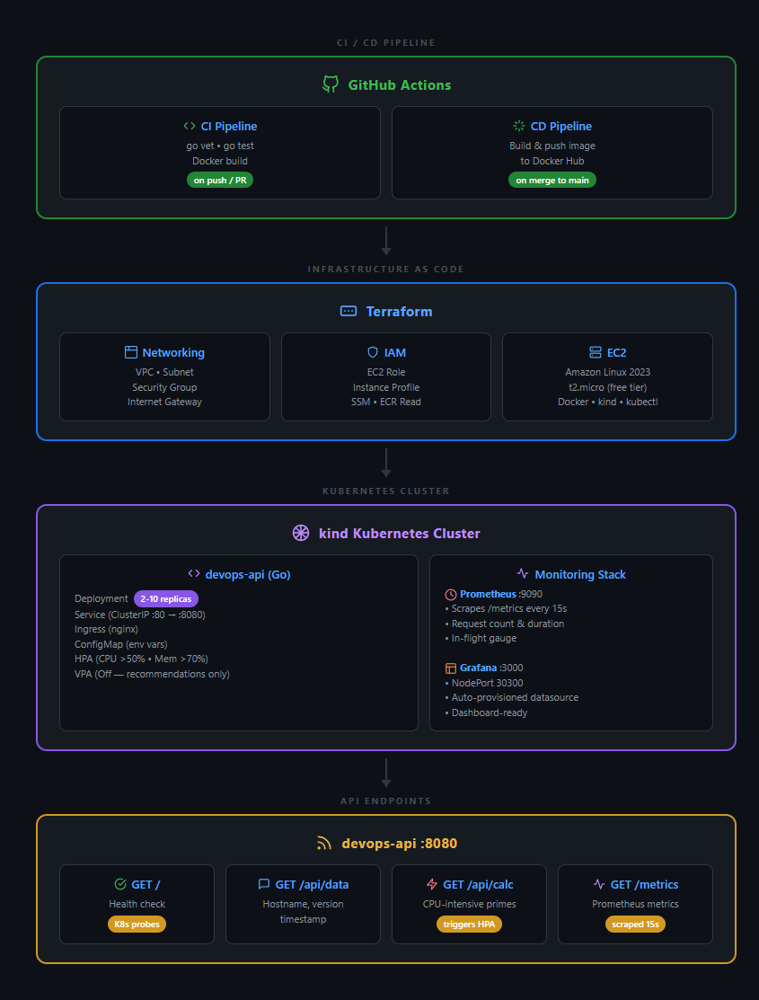

## Features

- **Go Backend API** — Health checks, system info, CPU-intensive prime calculation for autoscaling demos
- **Prometheus Metrics** — Request count, duration histograms, in-flight gauge, Go runtime stats
- **Multi-stage Docker Build** — Minimal Alpine image (~15 MB), non-root user, static binary
- **Kubernetes Manifests** — Deployment, Service, Ingress, ConfigMap with resource limits
- **HPA Autoscaling** — Scales 2→10 pods based on CPU (>50%) and memory (>70%) utilization
- **VPA Recommendations** — Right-sizing suggestions without auto-applying changes
- **Helm Chart** — Single-command deployment of the full stack (app, monitoring, autoscaling)
- **Kustomize Overlays** — Dev (1 replica, low resources) and Prod (3 replicas, higher limits)
- **Prometheus + Grafana** — Auto-provisioned datasource, ready for dashboard imports
- **Terraform IaC** — VPC, subnet, security groups, IAM, EC2 with user-data bootstrapping
- **CI/CD Pipeline** — GitHub Actions for automated testing, building, and Docker Hub push
- **Load Testing** — Built-in curl-based load test script (no external tools needed)

## Prerequisites

- [Go](https://go.dev/dl/) 1.22+
- [Docker](https://docs.docker.com/get-docker/)
- [kind](https://kind.sigs.k8s.io/docs/user/quick-start/#installation)
- [kubectl](https://kubernetes.io/docs/tasks/tools/)
- [Helm](https://helm.sh/docs/intro/install/) 3.x (optional — for Helm-based deployment)
- [Terraform](https://developer.hashicorp.com/terraform/downloads) 1.5+ (for AWS deployment)
- [AWS CLI](https://aws.amazon.com/cli/) (for AWS deployment)

## Quick Start (Local with kind)

```bash
# 1. Clone the repository
git clone https://github.com/goldenbutter/devops-terraform-k8s-deployment.git
cd devops-terraform-k8s-deployment

# 2. Build the Docker image
bash scripts/docker-build.sh

# 3. Deploy to a local kind cluster
bash scripts/deploy-kind.sh

# 4. Verify the deployment
kubectl get pods
curl http://localhost:8080/
curl http://localhost:8080/api/data

# 5. Access Grafana
# Open http://localhost:30300 — login: admin / admin

# 6. Run a load test to trigger autoscaling
bash scripts/load-test.sh
kubectl get hpa devops-api -w
```

## Deploy with Helm (Alternative)

The project includes a Helm chart that packages all K8s manifests (app, monitoring, autoscaling) into a single deployable unit.

```bash
# Preview rendered templates
helm template devops-api deploy/helm/devops-api

# Install to current cluster
helm install devops-api deploy/helm/devops-api

# Install with custom values (e.g. prod with higher resources)
helm install devops-api deploy/helm/devops-api \
  --set replicaCount=3 \
  --set resources.requests.cpu=100m \
  --set resources.limits.cpu=500m

# Upgrade after changes
helm upgrade devops-api deploy/helm/devops-api

# Uninstall
helm uninstall devops-api
```

The chart deploys: Deployment, Service, Ingress, ConfigMap, HPA, VPA, Prometheus, and Grafana — all configurable via `deploy/helm/devops-api/values.yaml`.

## Deploy to AWS

> For the full step-by-step walkthrough (key pair creation, troubleshooting, cost estimate), see [docs/terraform-setup.md](docs/terraform-setup.md).

```bash
# 1. Configure AWS credentials
aws configure

# 2. Create a terraform.tfvars file
cat > infra/terraform/terraform.tfvars <<EOF
aws_region       = "us-east-1"
instance_type    = "t2.micro"
key_name         = "your-key-pair-name"
allowed_ssh_cidr = "YOUR_IP/32"
EOF

# 3. Provision infrastructure
cd infra/terraform
terraform init
terraform plan
terraform apply

# 4. SSH into the instance and deploy
ssh -i ~/.ssh/your-key.pem ec2-user@$(terraform output -raw ec2_public_ip)

# On the EC2 instance:
kubectl apply -f deploy/k8s/base/
kubectl apply -f deploy/k8s/monitoring/prometheus/
kubectl apply -f deploy/k8s/monitoring/grafana/
```

## Folder Structure

```
devops-terraform-k8s-deployment/
├── app/                          # Go backend application
│   ├── cmd/server/main.go        # Entry point with graceful shutdown
│   ├── internal/
│   │   ├── handlers/handlers.go  # HTTP route handlers
│   │   ├── metrics/metrics.go    # Prometheus metric definitions
│   │   └── services/calc.go      # CPU-intensive calculation logic
│   ├── Dockerfile                # Multi-stage Docker build
│   ├── go.mod                    # Go module definition
│   └── go.sum                    # Dependency checksums
├── deploy/
│   ├── helm/devops-api/          # Helm chart (alternative to raw manifests)
│   │   ├── Chart.yaml            # Chart metadata
│   │   ├── values.yaml           # Default configuration values
│   │   └── templates/            # Templated K8s manifests
│   ├── k8s/
│   │   ├── base/                 # Core K8s manifests
│   │   │   ├── deployment.yaml   # 2-replica deployment with probes
│   │   │   ├── service.yaml      # ClusterIP service
│   │   │   ├── ingress.yaml      # Nginx ingress
│   │   │   ├── hpa.yaml          # Horizontal Pod Autoscaler
│   │   │   ├── vpa.yaml          # Vertical Pod Autoscaler (Off mode)
│   │   │   └── configmap.yaml    # Application config
│   │   ├── monitoring/
│   │   │   ├── prometheus/       # Prometheus deployment + config
│   │   │   └── grafana/          # Grafana deployment + datasource
│   │   └── kustomize/
│   │       ├── dev/              # Dev overlay (1 replica, low resources)
│   │       └── prod/             # Prod overlay (3 replicas, high resources)
│   └── Makefile                  # Build/deploy convenience targets
├── infra/terraform/              # AWS infrastructure as code
│   ├── modules/
│   │   ├── networking/           # VPC, subnet, security group
│   │   ├── iam/                  # IAM role + instance profile
│   │   └── ec2/                  # EC2 instance with user-data
│   ├── provider.tf
│   ├── variables.tf
│   ├── main.tf
│   └── outputs.tf
├── scripts/                      # Automation scripts
│   ├── build.sh                  # Compile Go binary
│   ├── docker-build.sh           # Build Docker image
│   ├── docker-push.sh            # Push to Docker Hub
│   ├── deploy-kind.sh            # Deploy to local kind cluster
│   └── load-test.sh              # Curl-based load test
├── .github/workflows/
│   ├── ci.yaml                   # Go vet, test, Docker build
│   └── cd.yaml                   # Docker Hub push
└── docs/                         # Project documentation
    ├── architecture-diagram.md
    ├── scaling-tests.md
    ├── monitoring-dashboards.md
    └── terraform-setup.md
```

## API Endpoints

| Endpoint     | Method | Description                                    |
|-------------|--------|------------------------------------------------|
| `/`         | GET    | Health check — returns `{"status":"ok"}`       |
| `/api/data` | GET    | System info (hostname, version, timestamp)     |
| `/api/calc` | GET    | CPU-intensive prime calculation (triggers HPA)  |
| `/metrics`  | GET    | Prometheus metrics endpoint                     |

## Load Testing & Autoscaling

> Full guide with expected results and troubleshooting: [docs/scaling-tests.md](docs/scaling-tests.md)

```bash
# Run load test (50 concurrent workers, 60 seconds)
bash scripts/load-test.sh

# Watch HPA scaling in real-time
kubectl get hpa devops-api -w

# Check VPA recommendations
kubectl describe vpa devops-api
```

## Accessing Grafana

> Full guide with PromQL queries, dashboard layout, and panel setup: [docs/monitoring-dashboards.md](docs/monitoring-dashboards.md)

1. Open `http://localhost:30300` (kind) or `http://<ec2-ip>:30300` (AWS)
2. Login with `admin` / `admin`
3. Prometheus is pre-configured as the default datasource
4. Import dashboard ID `1860` for Node Exporter or create custom dashboards

## Screenshots

### Local (kind) — API Responses

**Health Check** — `GET /`

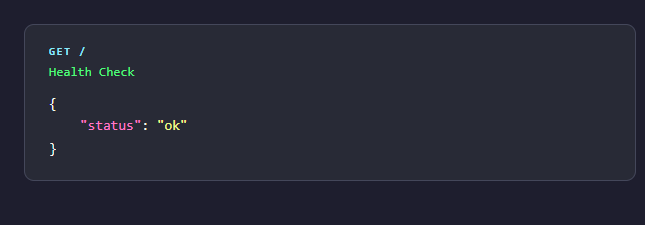

**System Info** — `GET /api/data`

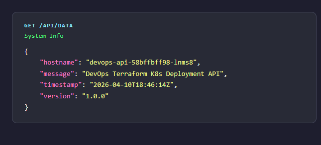

**CPU-Intensive Calculation** — `GET /api/calc`

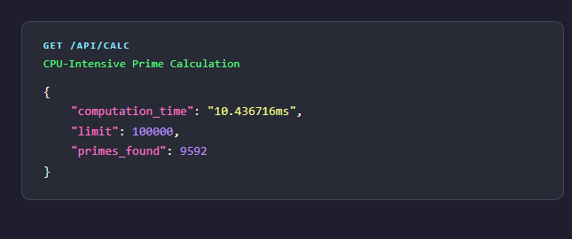

### Local (kind) — Kubernetes Cluster

**Running Pods**

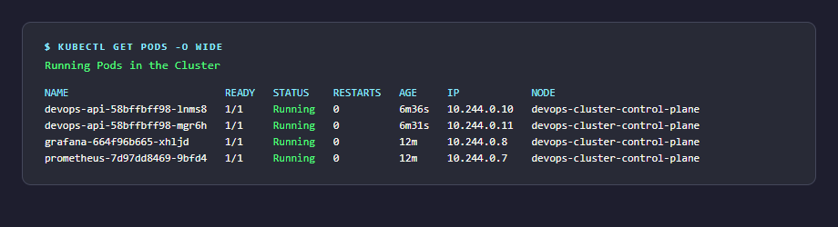

**HPA & Services**

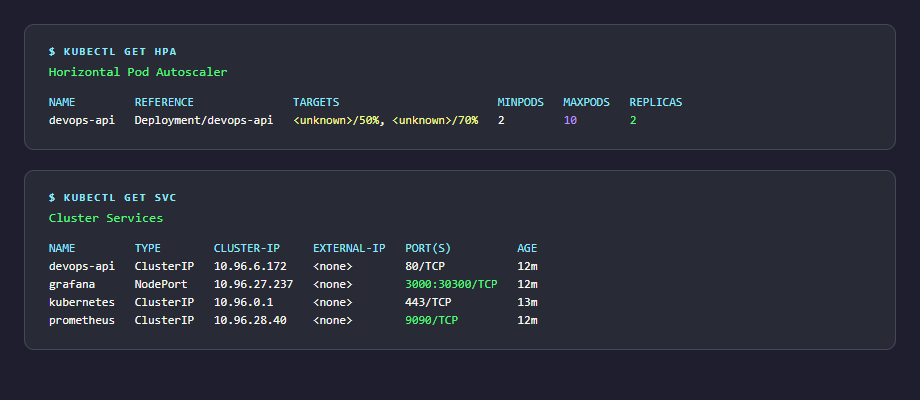

### Local (kind) — Monitoring Stack

**Grafana Home** — Auto-provisioned Prometheus datasource

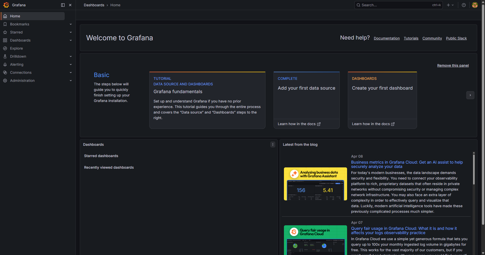

**Grafana Datasource** — Prometheus connected

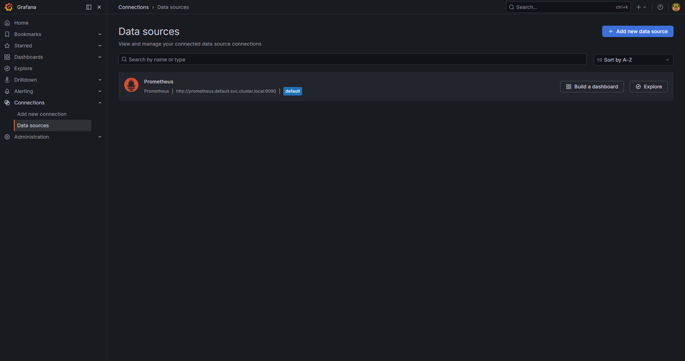

**Grafana Explore** — Live `http_requests_total` metrics from the API

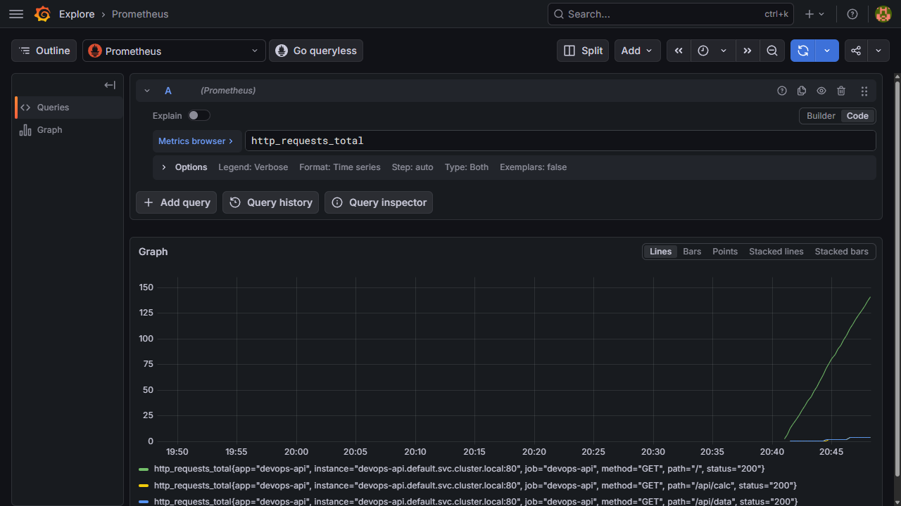

### AWS EC2 — API Responses

**Health Check** — `GET /` on EC2

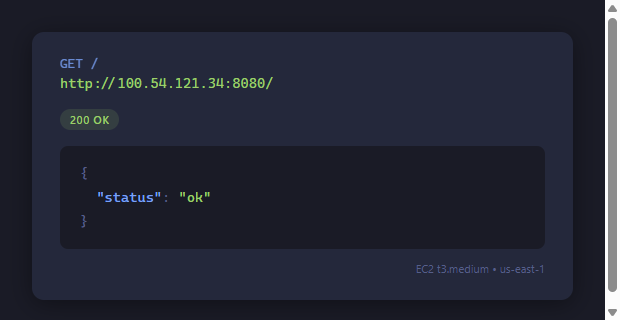

**System Info** — `GET /api/data` on EC2

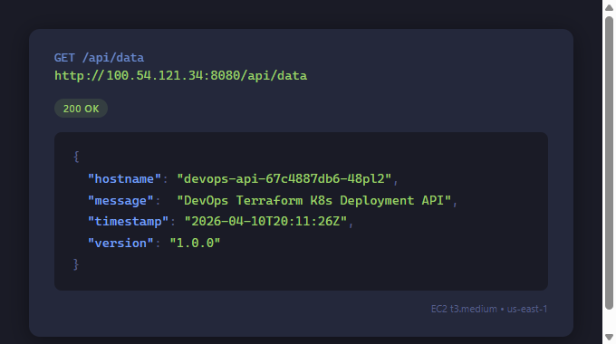

**CPU-Intensive Calculation** — `GET /api/calc` on EC2

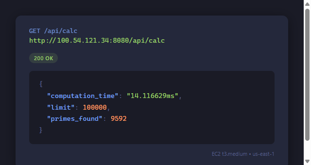

### AWS EC2 — Kubernetes Cluster

**Running Pods** — All 4 pods healthy on EC2 (t3.medium, us-east-1)

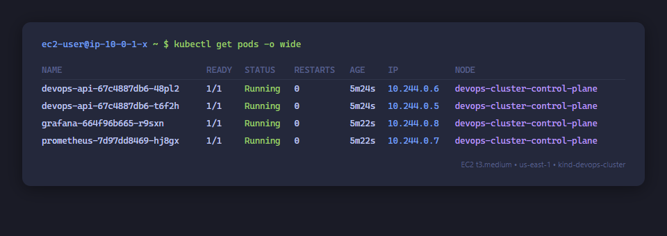

**HPA & Services** — Autoscaler and services on EC2

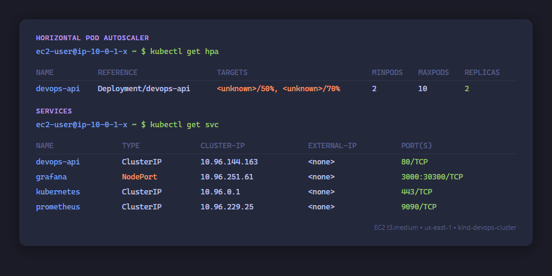

### AWS EC2 — Monitoring Stack

**Grafana Home** — Accessible at `http://<ec2-ip>:30300`

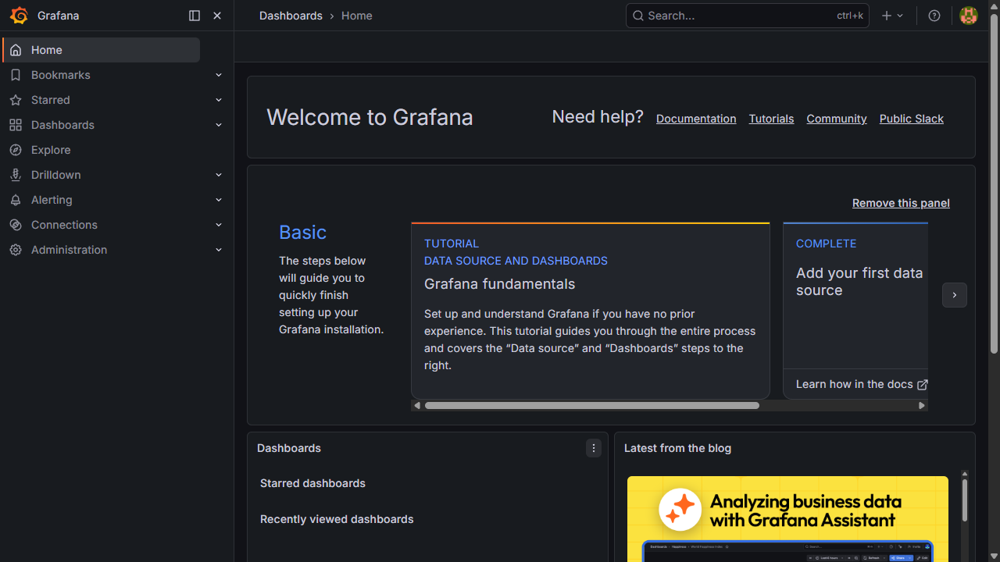

**Grafana Datasource** — Prometheus auto-provisioned on EC2

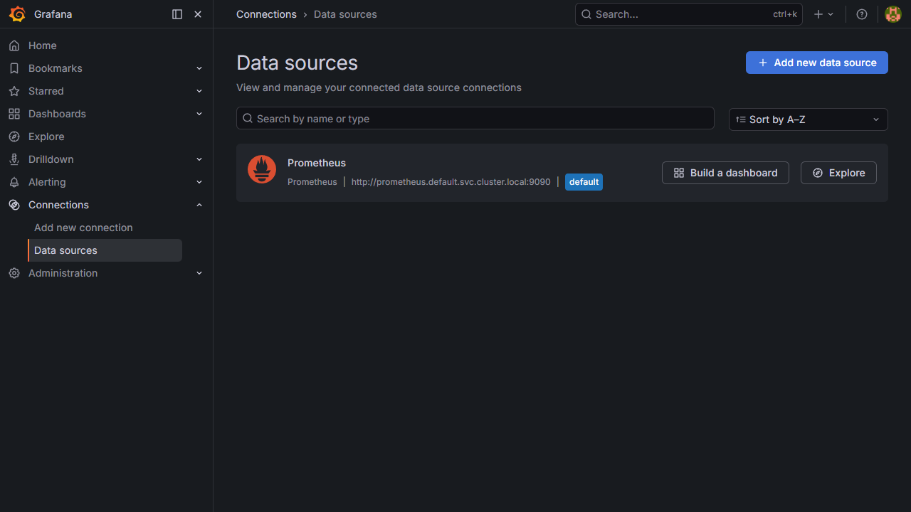

**Grafana Explore** — Live `http_requests_total` metrics from the EC2 deployment

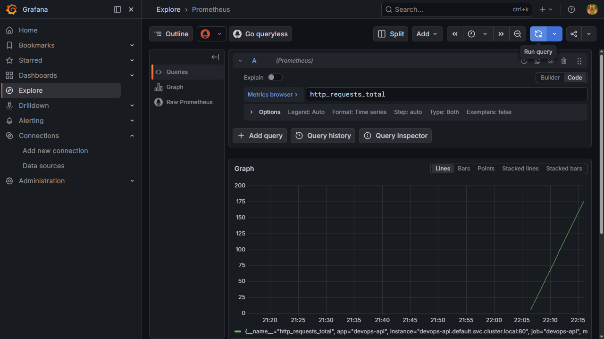

### AWS EC2 — HPA Autoscaling Demo

**Idle State** — 2 replicas, CPU at 2% (well below 50% threshold)

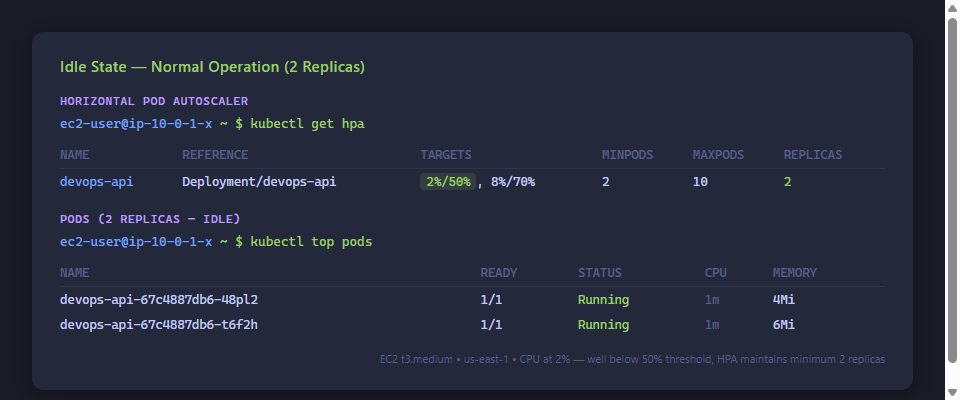

**Under Load** — HPA scales 2→5 pods as CPU hits 120% from `/api/calc` load test

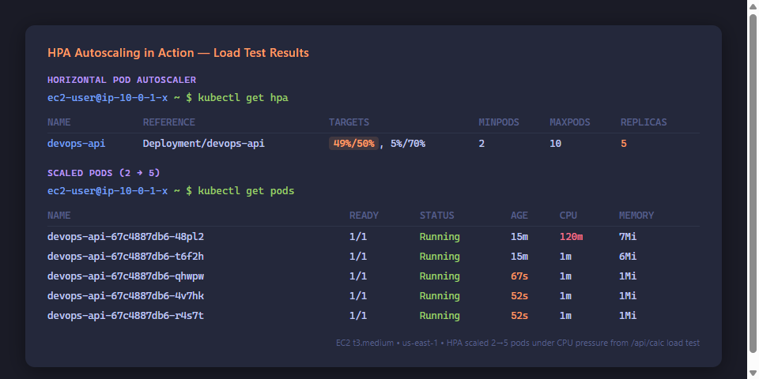

**Grafana — Request Rate Spike** — `rate(http_requests_total[1m])` shows the load test burst

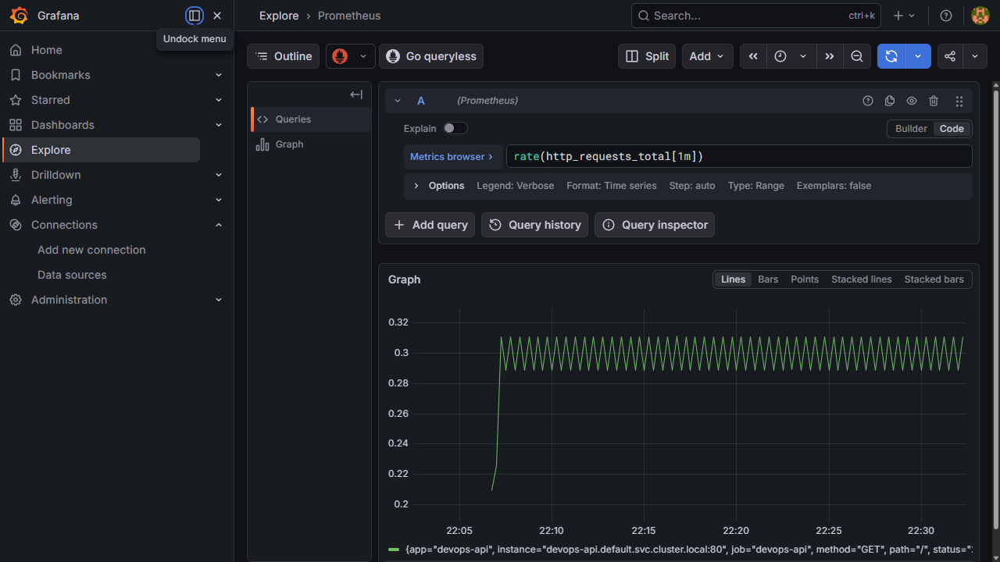

**VPA Recommendations** — Right-sizing suggestions (Off mode, no auto-apply)

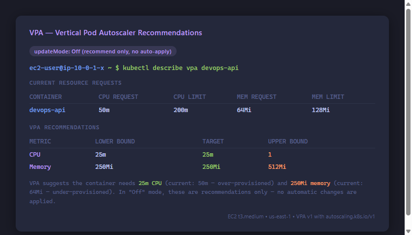

## Tech Stack

| Category        | Technology                          |
|----------------|-------------------------------------|
| Language        | Go 1.22                             |
| Containerization| Docker (multi-stage build)          |
| Orchestration   | Kubernetes (kind for local, EKS-ready) |
| IaC            | Terraform 1.5+                      |
| Monitoring     | Prometheus + Grafana                |
| CI/CD          | GitHub Actions                      |
| Cloud          | AWS (EC2 free-tier, VPC)            |
| Autoscaling    | HPA (CPU/Memory) + VPA              |

## Contributing

Contributions are welcome! Please read the [Contributing Guide](CONTRIBUTING.md) before submitting a PR.

**Key rules:** Always create an issue first, use feature branches, never push to `main` directly.

## License

MIT License — see [LICENSE](LICENSE) for details.

---

© [Bithun](https://portfolio.ibithun.com/)
